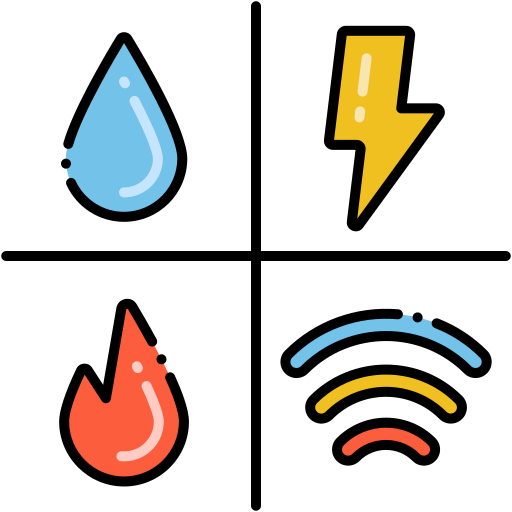

  

# Utilități Moldova - Home Assistant Custom Integration

A unified Home Assistant integration for managing Moldova utility services. Centralizes invoices, payment due dates, overdue notifications, and meter index submissions in one clean interface, regardless of utility provider.

> [!WARNING]
> 🛠️ **Active Development Warning**: This project is under **active development** and may undergo frequent changes or be unstable. Use with caution.

---

## 🏢 Supported Providers & Development Status

| Provider | Utility Type | Status | Supported Features |
|---|---|---|---|
| 🚰 **InfoSarp** | Water & Communal / Servicii Comunale | 🟢 **Supported** | Invoice tracking, Balance, Line-item breakdown |
| 🔥 **Energocom** | Natural Gas / Gaz | 🟢 **Supported** | Invoice tracking, Balance |
| 🌐 **StarNet** | Internet & TV / Internet | 🟢 **Supported** | Invoice tracking, Balance |
| 💡 **Premier Energy** | Electricity / Energie Electrică | 🟢 **Supported** | Invoice tracking, Balance |
| 🗑️ **Regia AutoSalubritate** | Waste Management / Salubrizare | 🟡 **In Progress** | Invoice tracking, Balance (Pending live invoice) |
| 🔥 **Chișinău-Gaz** | Natural Gas / Gaze Naturale | ⚪ **Planned** | Invoice tracking, Balance, Index submission |

---

## ⚡ Features

- 🏢 **Multi-Provider Support**: Unified experience across utility providers in Moldova.
- 📊 **Sensors & Binary Sensors**: Balance (MDL), Due Date, Meter Index, Consumption, and Overdue Payment Alerts.
- ⚡ **Direct Meter Index Submission**: Submit monthly readings via Home Assistant services or UI.
- 🌐 **Multi-Language Support**: English, Romanian (`ro`), and Russian (`ru`).

---

## 📦 Installation via HACS

1. Open **HACS** in your Home Assistant instance.
2. Click the top-right 3 dots and select **Custom repositories**.
3. Add the repository URL `https://github.com/prescornic/ha_utilitati_md`.
4. Category: **Integration**.
5. Click **Add**, then find **Utilități Moldova** and click **Download**.
6. Restart Home Assistant.

---

## ⚙️ Configuration

1. Go to **Settings** -> **Devices & Services** -> **Add Integration**.
2. Search for **Utilități Moldova**.
3. Select your Utility Provider (e.g., **InfoSarp**, **Energocom**, **StarNet**, **Premier Energy**).
4. Enter Account Alias (optional) and Contract Number / NLC Code (e.g., `123456`).
5. Click **Submit**.

---

## 🛠️ Actions & Services

### `utilitati_md.submit_meter_reading`
Submit a new meter index reading directly to the utility provider.

| Attribute | Description | Example |
|---|---|---|
| `config_entry_id` | Target utility account integration entry ID | `c123456789...` |
| `reading_value` | Current index value | `14520.50` |

---

## 📄 License

MIT License. Developed for the Home Assistant Moldova Community.
